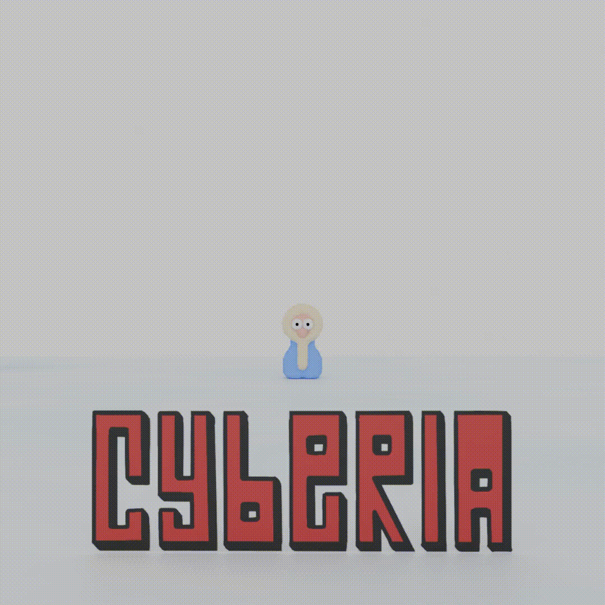

# Cyberia

## Quick Start

### Install dependencies

```bash
npm install
```

### Local Development

Run with local world server (backend):

```bash
npm run dev:local
```

Connects to: `ws://localhost:7777`

Run with production backend:

```bash
npm run dev:prod
```

Connects to: `wss://matchmaker.drawvid.com/`

### Start Both Frontend & Backend Together

From the drawvidverse root:

```bash
npm run dev:all
```

## Build

```bash
npm run build
```

## Development Modes

- **dev:local** - Connect to local world server (ws://localhost:7777)
- **dev:prod** - Connect to production backend (wss://matchmaker.drawvid.com/)
- **dev** - Same as dev:prod
